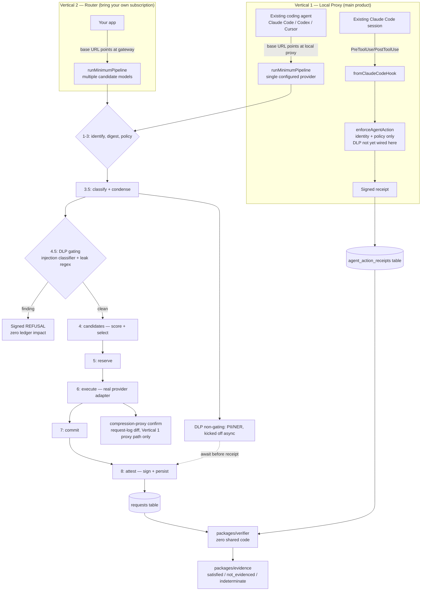

Both verticals run through the same underlying admission pipeline
(`packages/gateway/src/pipeline/run.ts`) — the difference between them is only *how many
candidate models/providers are configured* and *how traffic reaches the pipeline* (an HTTP hop
vs. a local hook). The one exception is the Claude Code hook path in Vertical 1, which is a
genuinely separate mechanism (`packages/hooks-cli`) that never goes through the gateway's HTTP
pipeline at all.



## Package layout

| Package | Role |
|---|---|
| `packages/schemas` | Zod wire formats — receipt, coverage declaration, evidence bundle, agent-action request. Single source of truth for shape. |
| `packages/attest` | RFC 8785 canonicalisation + Ed25519 signing as a flattened JWS. |
| `packages/gateway` | The pipeline itself — candidates, condense, DLP, ledger, coverage, providers, routing, a small Fastify server. Powers both verticals. |
| `packages/verifier` | Standalone verification + CLI. **Imports nothing from `attest` or `gateway`** — its own independent RFC 8785 implementation, on purpose. |
| `packages/evidence` | Compiles receipts + coverage declarations into signed, chained evidence bundles and an auditor export package (Merkle-style enumeration commitment). |
| `packages/hooks-cli` | Vertical 1's hook-based path — Claude Code (and, planned, other agent CLI) hook adapters, identity/policy enforcement, receipts for tool calls that never touch the gateway's HTTP pipeline. |
| `packages/web` | Server-rendered cost-governance admin UI — virtual keys, budgets, policy view. |
| `packages/sdk-node` | Scaffolded, not yet implemented. |
| `vendor/proxy-local` | Vendored third-party compression proxy (Apache-2.0) — real prompt compression backend for Vertical 1's proxy path. |
| `vendor/model-pricing` | Vendored third-party price map (MIT, data only). |

## Database

SQLite for development, Postgres planned — see [Current Status](/current-status) for the
migration plan.

`api_keys`, `policies` (immutable, versioned), `price_book`, `price_tiers`, `requests`
(receipts), `ledger_events` (append-only reserve/commit/release/correct), `budget_balances`,
`condense_proxy_savings`, `coverage_declarations`, `evidence_bundles`, `posture_records`,
`audit_events`, `control_manifests`, `agent_action_receipts`.

## File map

```
tokenops/
├── CLAUDE.md                    # standing project rules/instructions
├── README.md                    # top-level readme
├── docs/                        # this site
├── packages/
│   ├── schemas/src/             # Zod wire formats
│   ├── attest/src/               # canonicalisation + signing
│   ├── verifier/src/             # standalone verifier + CLI
│   ├── gateway/src/
│   │   ├── pipeline/             # runMinimumPipeline
│   │   ├── candidates/           # task/assurance classification
│   │   ├── condense/             # truncation + compression-proxy confirmation + llmlingua.ts
│   │   ├── dlp/                  # injection classifier, NER/PII, patterns
│   │   ├── routing/              # complexity scoring, auto-select
│   │   ├── ledger/               # reserve/commit/release/correct
│   │   ├── coverage/             # covered/gap declarations
│   │   ├── providers/            # every ProviderAdapter
│   │   ├── pricemap/             # price_book ingestion
│   │   ├── db/                   # schema.sql, migrate, seed
│   │   └── server/               # Fastify app (local HTTP edge)
│   ├── evidence/src/             # compiler, manifest, export
│   ├── hooks-cli/src/            # fromClaudeCodeHook, tokenops-audit.ts, enforce.ts
│   ├── web/src/                  # cost-governance admin UI
│   └── sdk-node/                 # scaffolded, empty
├── vendor/                       # proxy-local, model-pricing
├── scripts/                      # keygen, migrate, seed, try-it, llmlingua-proxy.ts, dlp-proxy.ts
├── tests/                        # golden, property
├── vertical1-dashboard/          # standalone React cost/speed comparison dashboard
├── keys/                         # Ed25519 keypairs (gitignored)
└── data/, out/                   # local SQLite DB, demo receipt output (gitignored)
```

## Core features

- **Signed receipts for every outcome** — executed, refused, *and* failed all produce a
  receipt. A 402 (budget) or a DLP refusal is proof a control fired, not a gap in the log.
- **Append-only budget ledger** — `reserve → commit / release / correct`, optimistic version
  guard, no mutable spend counter.
- **Immutable, versioned policy** — a policy change inserts a new row; `policy_version` and
  `price_version` are pinned onto the request once, at admission time, and never re-resolved.
- **Task/assurance classification** — a cheap, deterministic classifier decides whether a
  prompt is "legal/compliance" (never condensed, however long) before anything else runs.
- **Coverage declarations** — `covered` / `gap`, so "we didn't check" is a first-class, honest
  outcome rather than silently upgraded to "clean."
- **Evidence compiler** — turns receipts + coverage declarations into `satisfied` /
  `not_evidenced` / `indeterminate` verdicts, chained and signed.
- **Auditor export** — enumerates every evidence artifact under a digest commitment so a
  silently omitted record is detectable, not just a tampered one.
