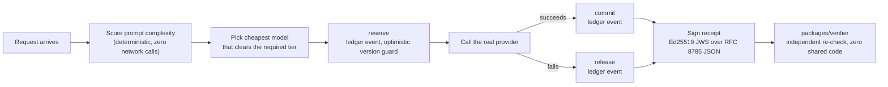

One flow, start to finish: a request gets routed to a model, its cost is reserved against a
budget *before* the provider is called, and whatever happens next — success or failure — ends
in a signed, independently-verifiable receipt.

## Routing

Auto-routing (Vertical 2) is **rule-based and deterministic** — a complexity scorer ported from
an existing MIT-licensed open-source implementation, zero network calls. Same prompt in, same
tier and same model out, every time. That determinism matters because the candidate set it
produces feeds a signed receipt: an auto-routed request's digest binds identity + prompt only,
never a caller-invisible candidate set the gateway happened to discover that day — so two
auto-routed calls with the same prompt share a digest regardless of which models happened to be
configured. It never silently falls back to a model below the required tier, either — no match
above the floor means no call.

## Cost attribution — the ledger

Money is an integer (micro-USD) end to end, never a float, moved only through one of four
append-only events — never a mutable spend counter, which would lose updates across a
multi-second provider call under concurrency:

| Event | When it fires | Effect on `budget_balances` |
|---|---|---|
| `reserve` | Before the provider is ever called | Holds the estimated cost against budget, guarded by an optimistic version check |
| `commit` | The provider call succeeded | Converts the reservation into real, final spend |
| `release` | The provider call failed | Returns the held amount — nothing was actually spent |
| `correct` | A price or usage figure needed a signed adjustment after the fact | Never edits history in place — inserts a new event instead |

`packages/web` renders a server-side admin UI on top of this ledger: virtual keys, per-team
budgets (backed by a real `setLimit` ledger event, never a raw `UPDATE`), and a read-only policy
view.

## Audit receipts

Every receipt is signed as a flattened JWS (Ed25519/EdDSA) over RFC 8785 canonical JSON — never
HMAC, because HMAC would mean only *we* can verify our own receipts, which defeats the entire
premise. `packages/verifier` re-implements canonicalisation independently and imports nothing
from the producing code (`packages/attest`/`packages/gateway`) — enforced by
`npm run test:boundary` — so a bug in one side's canonicalisation can't quietly agree with
itself.

`packages/evidence` compiles receipts and coverage declarations into bundles with three possible
verdicts per control:

<CardGroup cols={3}>
  <Card title="satisfied" icon="circle-check">
    Real evidence backs the claim.
  </Card>
  <Card title="not_evidenced" icon="circle-xmark">
    Checked, and it failed.
  </Card>
  <Card title="indeterminate" icon="circle-question">
    "We weren't watching" — never silently upgraded to `satisfied`.
  </Card>
</CardGroup>

The auditor export package enumerates every evidence artifact under a single digest commitment,
so a record that's silently *missing* is detectable the same way a *tampered* one is — change
one number and get `ADVERSE`; delete one record entirely and the enumeration commitment itself
no longer matches.

## Provider support

<AccordionGroup>
  <Accordion title="8 native adapters">
    Gemini, OpenAI, Anthropic, Anthropic-via-compression-proxy (`AnthropicTokenOpsAdapter`),
    Azure OpenAI, Cohere, Vertex AI, and a deterministic Mock (used throughout the test suite).
  </Accordion>
  <Accordion title="44 OpenAI-compatible endpoints">
    Wired generically through one adapter, only instantiated if their API key env var is
    actually set: Groq, Together, DeepSeek, Mistral, Fireworks, OpenRouter, Perplexity,
    DeepInfra, Cerebras, xAI, Moonshot, Baseten, Novita, Hyperbolic, SambaNova, Nebius, NVIDIA
    NIM, GitHub Models, Featherless, Friendli, GMI Cloud, Zhipu, DashScope, Baidu Qianfan,
    Doubao, Writer, SiliconFlow, Poe, Scaleway, HuggingFace, AI/ML API, Kluster, Chutes, Venice,
    Parasail, OVHcloud, Infercom, CloudRift, Martian — plus **local runtimes with no API key at
    all**: Ollama, LM Studio, vLLM, LocalAI, text-generation-webui.
  </Accordion>
</AccordionGroup>

Adding provider N+1 touches **only** `packages/gateway/src/providers/` — write a
`ProviderAdapter`, register it, add a `price_book` row. No change to the ledger, `attest`,
`verifier`, or schemas.
